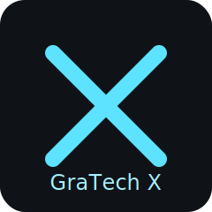
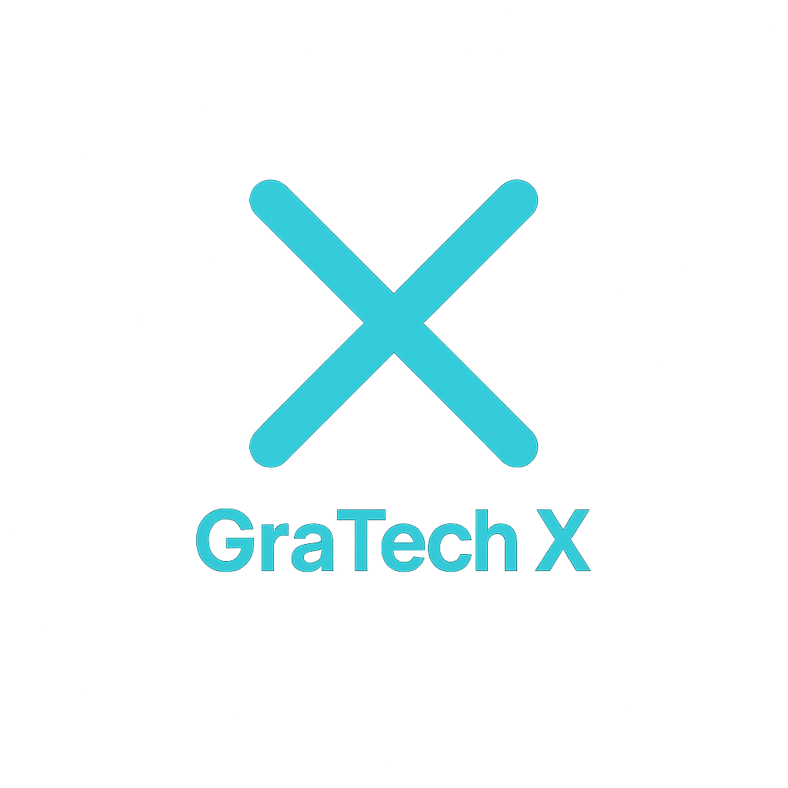

# GraTech X · Suliman Alshammari

**Sovereign AI Engineer** · Privacy-First, Local-Run AI for Humanity

Independent AI on your device — no servers, full control, open to all.

**Core**: Local-First · Tri-Lobe Architecture · On-Device · Multilingual

---

## Vision
Building a sovereign AI ecosystem that runs entirely locally — browser or device — with complete privacy and user independence.

*Tri-Lobe Architecture · Multi-Model Support · Zero Data Leaks · Open Source Focus*

---

## Key Projects

| Project | Description | Tech | Status | Link |
|---|---|---|---|---|
| Comet-X | 100% local AI platform (browser-based) | JavaScript | Active | https://github.com/gratechx/cometx |
| GraTech Ultimate | Full-stack sovereign multi-model AI | TypeScript | Developing | https://github.com/gratechx/gratech-ultimate |
| Comet-X Desktop | Desktop assistant with magical UI | JavaScript | Functional | https://github.com/gratechx/comet-x-desktop |
| Comet-X Browser | Private AI Chrome extension | JavaScript | Active | https://github.com/gratechx/comet-x-browser |
| Haven / HUMANAGENT | Private sovereign AI companion | Mixed | Early | https://github.com/gratechx/Haven |
| Automation Bot | GitHub/Azure/Teams automation | Python | Active | https://github.com/gratechx/cometx-automation-bot |

---

## الرؤية بالعربية
بناء منظومة ذكاء اصطناعي سيادية تعمل محليًا كاملًا — في المتصفح أو الجهاز — مع خصوصية مطلقة واستقلال للمستخدم.

معمارية ثلاثية الفصوص · دعم نماذج متعددة · بدون تسرب بيانات · تركيز على المصدر المفتوح

---

## Connect
- Website: https://www.gratech.sa
- X: @CometXApp
- LinkedIn: graxgenius
- TikTok: @gratech.sa
- Email: admin@gratech.sa

Open Source · MIT Licensed where possible · For privacy and independence  
#SovereignAI #LocalAI #PrivacyFirst #OpenSource

## Brand Kit · شعارات GraTech X

**Dark**

**3D**

**Neon**

